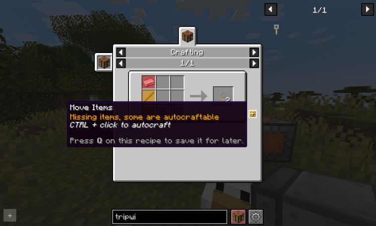
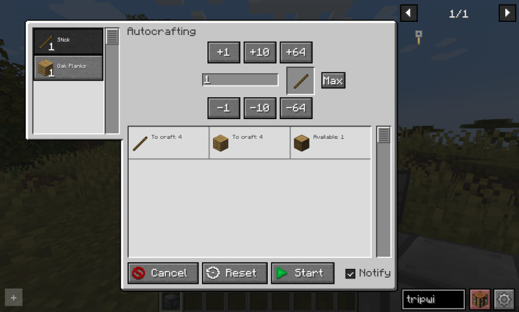
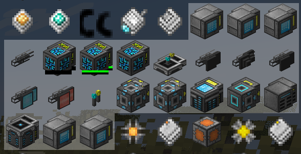
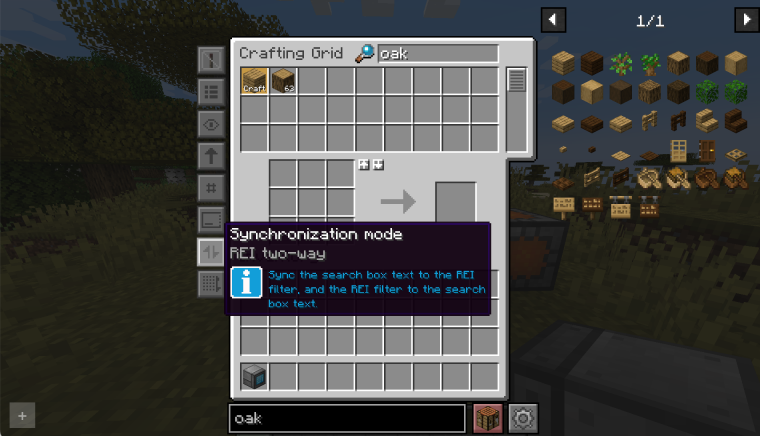
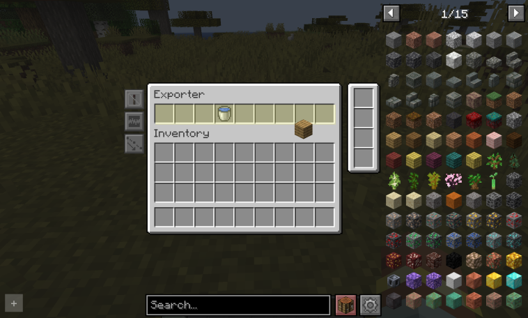

= Roughly Enough Items (REI)

Refined Storage has an optional integration mod for Roughly Enough Items (REI), enhancing crafting and recipe interaction.

[#_recipe_transferring_in_the_crafting_grid]
== Recipe transferring in the Crafting Grid

You can transfer recipes from REI directly into the xref:../viewing-resources/crafting-grid.adoc[].

- Missing ingredients? The transfer will still place what you have.
- If autocrafting is available for missing ingredients, you can start autocrafting tasks from the preview.

[#_recipe_transferring_in_the_pattern_grid]
== Recipe transferring in the Pattern Grid

Recipes from REI can also be transferred into the xref:../autocrafting/pattern-grid.adoc[].
The interface will show which ingredients are autocraftable.

== Item grouping

Related items are grouped together from the recipe viewer.

== R/U key support
You can use the R and U keys on xref:../viewing-resources/grid.adoc[] and filter slots to view recipes and usages respectively.

[#_recipe_viewer_synchronization]
== Recipe viewer synchronization

You can sync the search box between REI and the xref:../viewing-resources/grid.adoc[]:

- One-way (Grid → REI)
- Two-way sync

== Ghost ingredient dragging

You can drag any type of ingredient from REI to filter slots in Refined Storage.

== Exclusion zones

REI elements automatically reposition to avoid overlapping Refined Storage GUI components.
