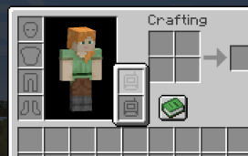

= Trinkets integration

An optional integration mod adds support for Trinkets on Fabric, providing two dedicated Trinket slots for the following tools:

- xref:../wireless-networking/wireless-grid.adoc[]
- xref:../wireless-networking/creative-wireless-grid.adoc[]
- xref:../wireless-networking/wireless-crafting-grid.adoc[]
- xref:../wireless-networking/creative-wireless-crafting-grid.adoc[]
- xref:../viewing-resources/portable-grid.adoc[]
- xref:../viewing-resources/creative-portable-grid.adoc[]

You can combine this with a keybinding to quickly open these tools while equipped.

== Download

- link:https://www.curseforge.com/minecraft/mc-mods/refined-storage-trinkets-integration[Download on CurseForge]
- link:https://modrinth.com/mod/refined-storage-trinkets-integration[Download on Modrinth]
