= What's new in Refined Storage 2
:type: article
:description: The first beta of Refined Storage v2.0.0 has been released. What's new?
:date: 2025-03-08

Since 2020, I've been working on Refined Storage 2—an evolution of the original mod, rebuilt from the ground up with a focus on code quality, modern architecture, and Fabric support. After years of development and public GitHub milestones, the first beta is now available on CurseForge and Modrinth for Minecraft 1.21.1.

== Background

Refined Storage is nearly ten years old, and its codebase was starting to show its age. While none of the original 2015 code likely remained—thanks to years of refactors—it still felt like the right time for a clean slate.

The biggest issue with the old version was that, while functional, its internal structure had become a burden. It lacked tests, and the architecture made it difficult to maintain, evolve, or prevent regressions.

I started Refined Storage back in high school. Today, I'm a professional software engineer. I wanted the codebase to reflect that growth and be something I could keep enjoying and supporting.

Rewriting a mod of this size was a big risk. It could’ve failed. But I believed it was necessary to secure the long-term future of the project.

Refined Storage 2 has been rebuilt from the ground up with:

- A strong focus on code quality
- Long-term maintainability
- Mod loader independence
- A complete rethinking and modernization of nearly every feature

== What has changed?

Refined Storage 2 is a complete rewrite, modernizing and rethinking nearly every part of the mod. Below is a categorized and detailed overview of the most important changes and additions.

=== Official integrations and addons

To reduce core complexity, integrations have been moved to their own addon mods.

Removed from core into a dedicated addon:

- xref:../addons/just-enough-items.adoc[]
- xref:../addons/curios.adoc[] (NeoForge)

New integrations:

- xref:../addons/roughly-enough-items.adoc[]
- xref:../addons/emi.adoc[]
- xref:../addons/mekanism.adoc[**Mekanism integration** with chemical storage support]
* 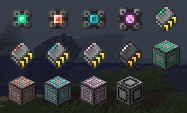
- NeoForge config screen
- xref:../addons/fabric-ecosystem.adoc[]
* xref:../addons/trinkets.adoc[]

=== Viewing resources

- The *Fluid Grid* was removed. The regular xref:../viewing-resources/grid.adoc[*Grid*] now handles items, fluids, and chemicals.
* 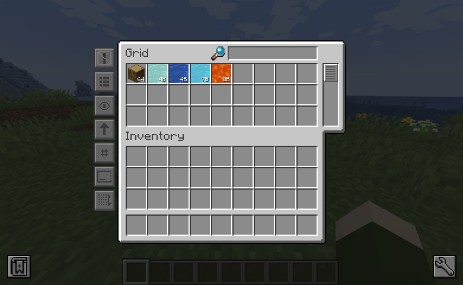
- Fluids and chemicals can be inserted by right-clicking a container onto the Grid.
- The Grid supports a *Resource Type* filter, defaulting to "All".
- Grid tag search now uses `#`, and tooltip search uses `$`.
- The *Grid search bar* supports complex expressions and syntax highlighting.
* 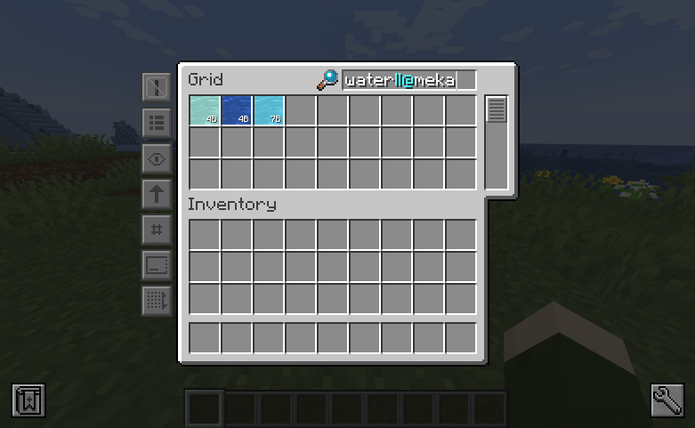
- New slot hints show what will be inserted or extracted.
* 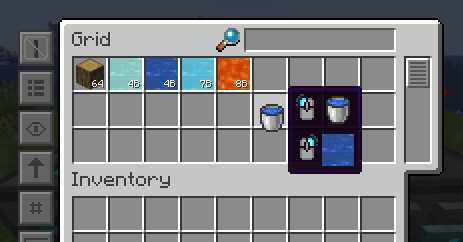
* 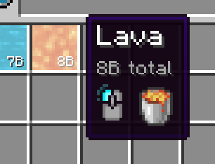
- The xref:../viewing-resources/crafting-grid.adoc[*Crafting Grid*] adds:
* A clear-to-player-inventory button.
* A keybinding to clear to inventory (NeoForge only).
* A shortcut (CTRL+SHIFT on result slot) to filter the Grid by crafting matrix contents.
* 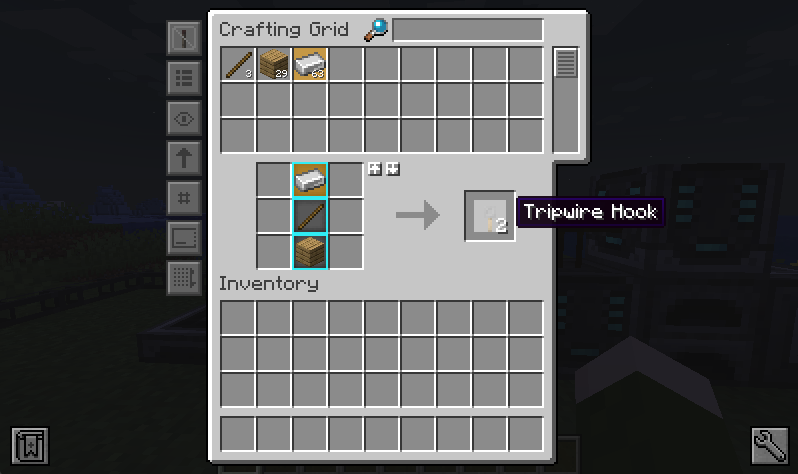
* A config option to clear items from the matrix to the player or network inventory when closing the screen.
* 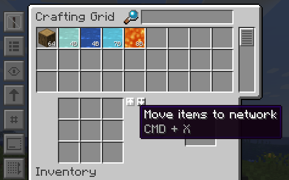
- The amount screen (e.g., for Detectors) now:
* Supports scrollbars and increment/decrement buttons.
* Highlights invalid amounts in red.
* 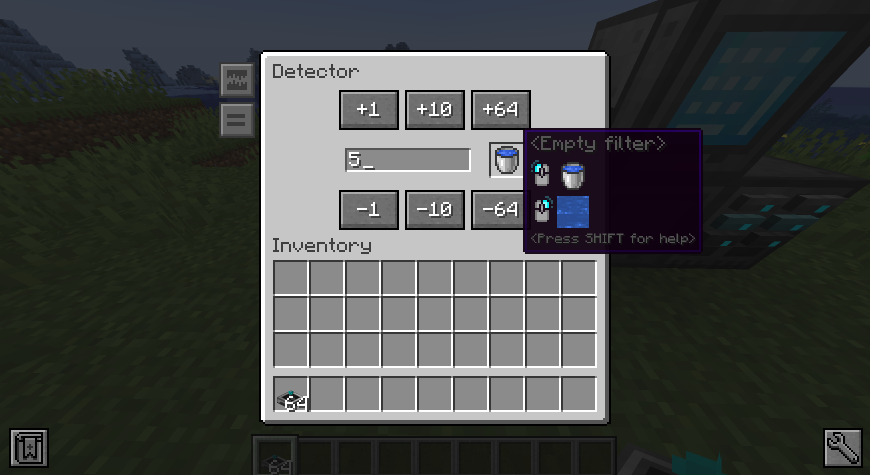
- Grid UI settings like smooth scrolling and row stretch are now global client config.
- The Portable Grid UI now displays an energy bar.
- Contents of storages in "insert-only" mode are now visible in the Grid.

=== Autocrafting

- The *Crafter* has been renamed to the xref:../autocrafting/autocrafter.adoc[*Autocrafter*].
- The *Autocrafter* now:
* Faces the block you're placing it against, like other cable blocks.
* Supports renaming from the GUI.
* Supports configuring a priority value to give precedence to patterns with the same output.
* Allows toggling visibility to the Autocrafter Manager (enabled by default).
* Connects to other Autocrafters only through the front face, avoiding unintended network connections when used with Interfaces.
* 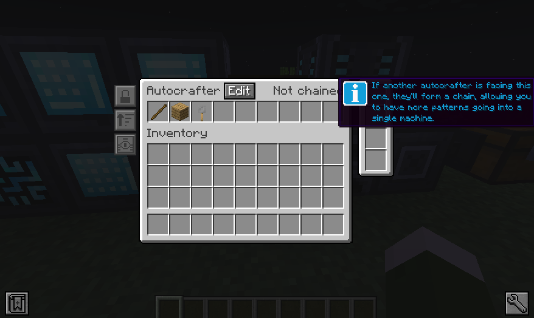
- *Locking mode* replaces the old "crafter mode" with:
* Never
* Lock until redstone pulse
* Lock until connected machine is empty (for blocking mode)
* Lock until all outputs are received (for blocking mode)
* Lock until low redstone signal
* Lock until high redstone signal
* In chained Autocrafters, locking mode can only be configured on the head.
- The xref:../autocrafting/autocrafter-manager.adoc[*Autocrafter Manager*] now includes:
* A view filter: All, Not Full, or Visible-only Autocrafters.
* A revamped search that targets pattern inputs, outputs, names, or all.
- You can initiate autocrafting from the xref:../viewing-resources/storage-monitor.adoc[*Storage Monitor*] if the resource count is zero.
- When multiple patterns share an output, the one with the highest priority is used first.
- Tasks can’t be cancelled if there’s not enough storage space to return intermediates.
- The **crafting preview** now:
* Merges preview and amount selection into one screen with live updates.
* Lets you fill out the maximum amount craftable.
* Allows enabling notifications when a task is completed.
* 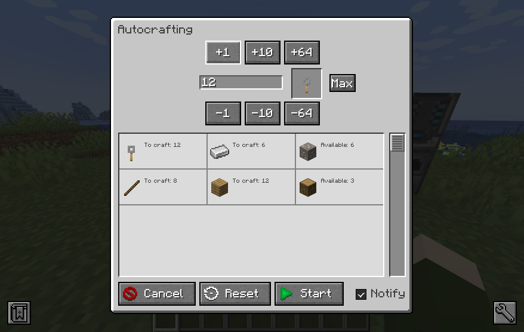
* Shows all parallel requests triggered by recipe mods.
- The xref:../autocrafting/autocrafting-monitor.adoc[**Autocrafting Monitor**] now:
* Uses compacted units.
* Displays which machine is processing each step.
* Uses a sidebar for tasks instead of tabs.
* 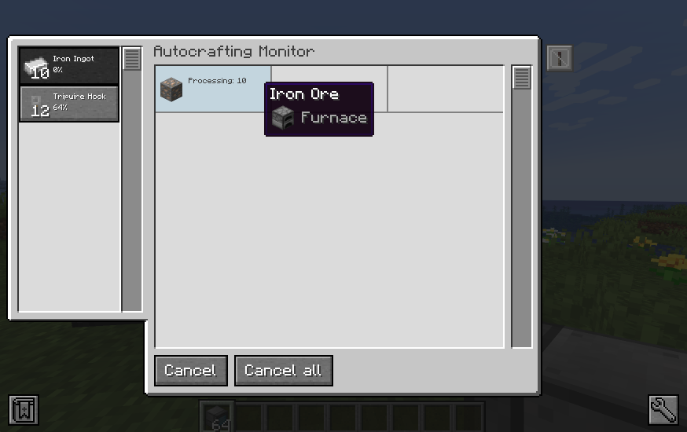
- The Grid and Pattern Grid:
* Visually mark autocraftable items with orange backdrops and tooltips.
* Also consider uninserted patterns in your inventory.
* 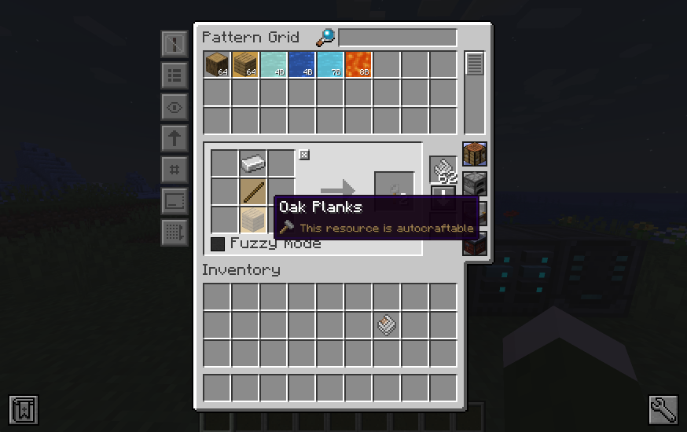
- xref:../autocrafting/pattern.adoc[*Patterns*]:
* Show the recipe in their tooltip.
* 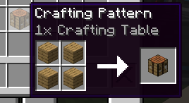
* Use different textures and names to distinguish from empty patterns.
* 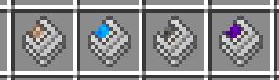
- The xref:../autocrafting/pattern-grid.adoc[**Pattern Grid**]:
* Supports encoding *stonecutter* and *smithing table* recipes.
* image:../../assets/news/whats-new-in-refined-storage-2/pattern-grid-types.png[Pattern Grid modes]
* 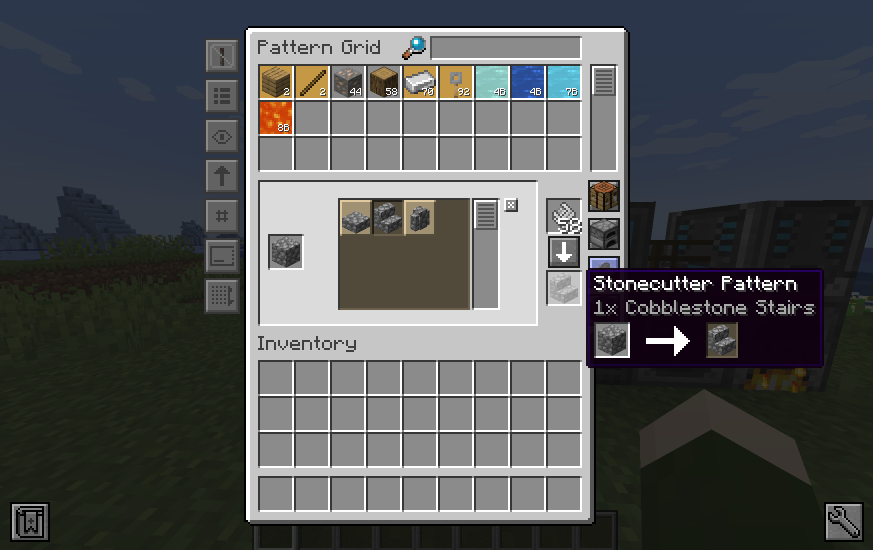
* The alternatives screen supports searching, tag-based resource groups (collapsible), and translated tag names.
* 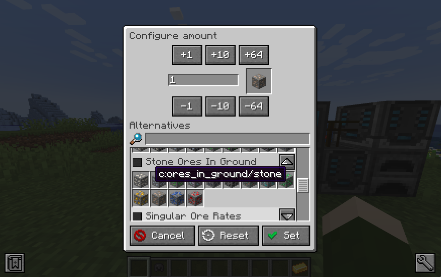
* "Exact mode" replaced by inverse *Fuzzy mode*.

=== Storage

- *Storage Disks and Blocks* can now be upgraded by combining with a higher-tier Storage Part. The original part is returned.
* 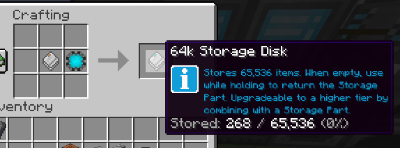
- You can now configure separate *insert and extract priorities* on storage.
* 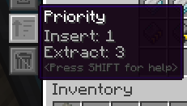
- The xref:../input-and-output/interface.adoc[*Interface*]:
* Now supports fluids and chemicals (replaces the "Fluid Interface").
* Supports extraction via buckets or other containers.
* No longer has dedicated import slots; input goes to export slots.
* Immediately imports and exports.
* 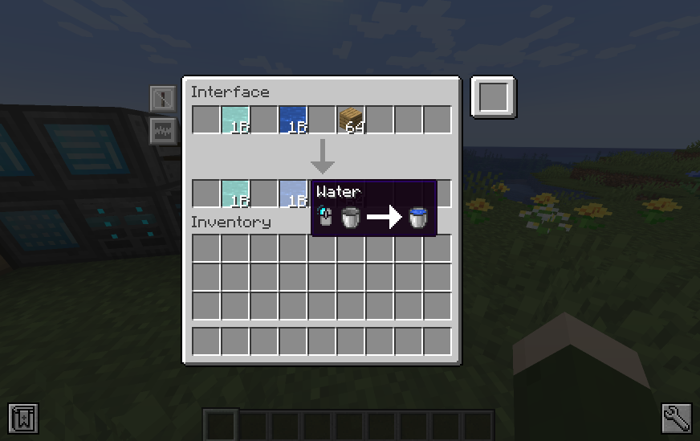
- The xref:../storage/external-storage.adoc[*External Storage*]:
* Supports multiple resource types simultaneously.
- The xref:../input-and-output/constructor.adoc[*Constructor*] and xref:../input-and-output/exporter.adoc[*Exporter*]:
* Support scheduling modes: first available, round robin, or random.
* Filter slots now show hints for missing, blocked, autocrafting, or uncraftable resources.
* image:../../assets/news/whats-new-in-refined-storage-2/filter-slot-hints.png[Filter slot hints]
- The xref:../input-and-output/importer.adoc[*Importer*]:
* Extracts as much of a single resource type as possible across all slots, following the per-tick quota.
* Automatically detects the connected resource type (item/fluid/chemical).
- The xref:../upgrades/regulator-upgrade.adoc[*Regulator Upgrade*]:
* Along Exporters now supports Importers and stops importing once the set amount is reached.
* Must now be configured via the item, not the device GUI.
- *Void excess* mode can be enabled on storages with an allowlist filter.
- You no longer have to pre-select a resource type in filter slots: right-click a container or drag from a recipe viewer instead.
- Item storage capacities are now multiples of 1024 for better stack alignment.
- A single resource can now exceed 2,147,483,647 units in storage.
- *Fuzzy mode* replaces "Exact mode" and is off by default for performance.
- The Disk Manipulator has been renamed to **Disk Interface**.

=== Networking

- Multiple xref:../networking/controller.adoc[*Controllers*] can now be placed in one network to meet energy demand.
- The xref:../networking/relay.adoc[*Relay*]:
* Can create **subnetworks** by disabling pass-through.
* Supports exposing energy, security, storage, and autocrafting to the output network.
* Subnet storage allows configuring filter mode, fuzzy mode, access mode, and priority.
* link:https://www.youtube.com/watch?v=fRGH4ZUAnhQ[Check out this video explaining how pass-through modes work in the Relay]
- The xref:../wireless-networking/network-transmitter.adoc[*Network Transmitter*]:
* Shows an error when the Receiver connection breaks.
* Attempts to reconnect automatically if the connection is lost.
- The xref:../security/security-manager.adoc[*Security Manager*]:
* Locks the network by default when placed.
* xref:../security/security-card.adoc[*Security Cards*] are configured through their own GUI.
* Cards can be bound to online players.
* A xref:../security/fallback-security-card.adoc[*Fallback Security Card*] defines default access for unlisted players.
* The GUI shows which permissions were changed.
* 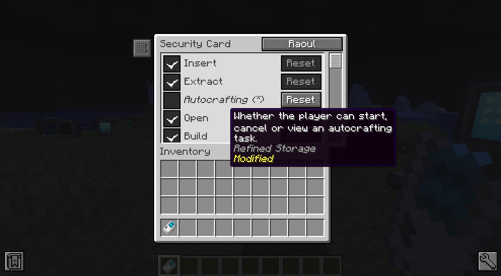

=== UI and accessibility

- Disk Drives, Disk Interfaces (formerly known as "Disk Manipulator"), and Portable Grids now render item, fluid, and chemical disks distinctly.
* 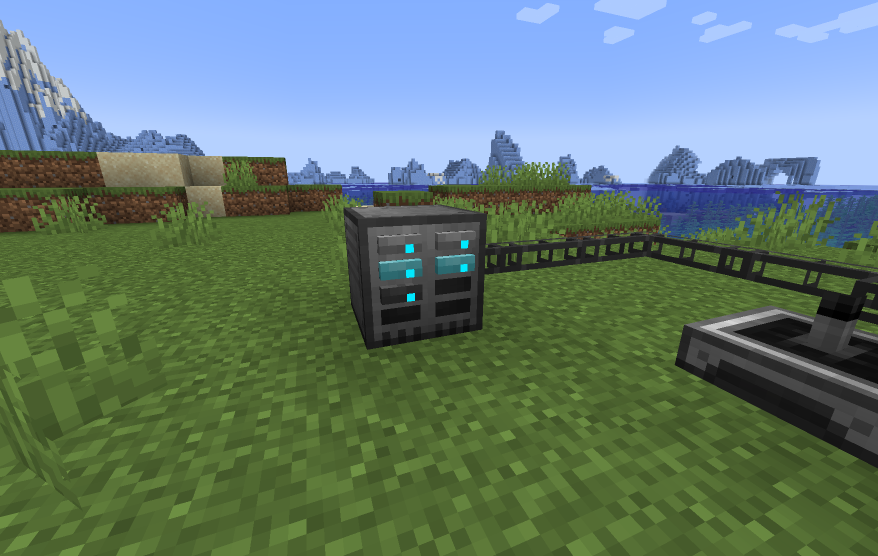
- GUI titles now scroll (marquee) when overflowing.
- New Grid size: *Extra Large* (12 rows).
- Hints, tooltips, and SHIFT-help added across many screens.
* 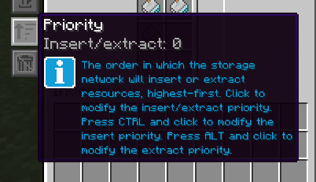
- Upgrade slots now show compatible upgrades.
* 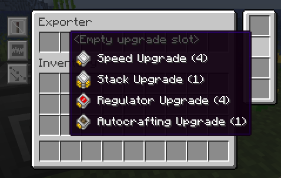
- Upgrade tooltips list supported devices.
* 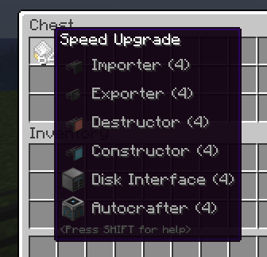
- JEI/REI/EMI search sync is now configurable separately from Grid auto-selection.

=== Other additions and tweaks

- Optimized memory usage and startup time.
- Improved Grid search performance.
- xref:../utility/configuration-card.adoc[*Configuration Card*] copies upgrades and settings between devices.
- xref:../utility/quartz-enriched-copper.adoc[*Quartz Enriched Copper*] is used to craft cables, giving copper a use.
- xref:../upgrades/creative-range-upgrade.adoc[*Creative Range Upgrade*] grants infinite wireless range in the xref:../wireless-networking/wireless-transmitter.adoc[].
- *Colored cables and variants* (Importers, Exporters, External Storages) connect only with matching colors.
- Detectors and Grids can now be placed in all directions (sideways, upside-down).
* 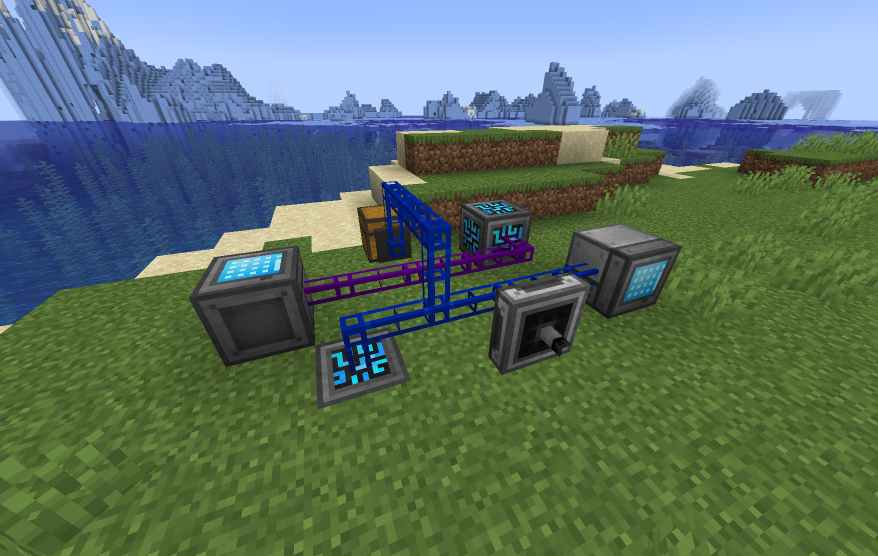
- New xref:../utility/wrench.adoc[*Wrench*] behavior:
* Crouch-wrench to dismantle a block (preserving config).
* Supports wrench tags like `c:wrenches`.
- Recipes now follow tag conventions from NeoForge and Fabric.
- Compatibility improvements with modded block movers:
* Fixed moving devices with mods like Carrier.
* Fixed CTRL+Click in creative mode not preserving block data.

== Infrastructure improvements

Refined Storage 2 wasn’t built in isolation. As part of its development, the broader Refined Mods ecosystem saw major upgrades:

- The website was overhauled with a brand-new wiki system that supports multiple versions side by side.
- The wiki was completely rewritten from scratch.
- link:https://github.com/refinedmods/refinedarchitect[Refined Architect] was created—a shared project used across all Refined Mods. It includes GitHub workflows, version management, and a Gradle convention plugin to simplify (cross-platform) mod development.

== What's next?

Refined Storage 2 will continue to receive frequent updates with new features and bug fixes. Most new functionality will be released as part of addons.

== Special thanks

This release was the result of a sustained, multi-year effort. I couldn't have done it without the incredible support from the community.

Special thanks to:

- My friends on the ForgeCraft server for helping out with all sorts of random questions.
- link:https://discordapp.com/invite/VYzsydb[The Refined Mods Discord community] for bug reports, testing, and feedback.
- Translators on Crowdin who eagerly kept up with all the changes.
- Technici4n for early API feedback and major influence on the final design.
- shartte for untangling Gradle issues.
- Ultramega for help with integration tests.
- My supporters on link:https://patreon.com/c/raoulvdberge[Patreon] and link:https://ko-fi.com/raoulvdberge[Ko-Fi].
- My partner Robin, for supporting me through every step of this journey.

> Disclaimer: Refined Storage v2.0.0 is **beta** software. While sufficiently tested, bugs may occur.
